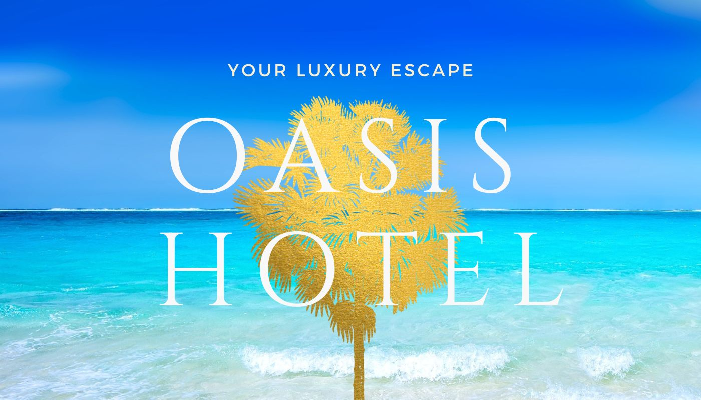
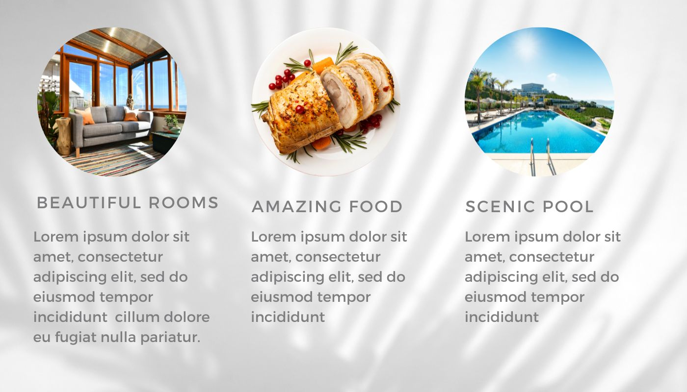
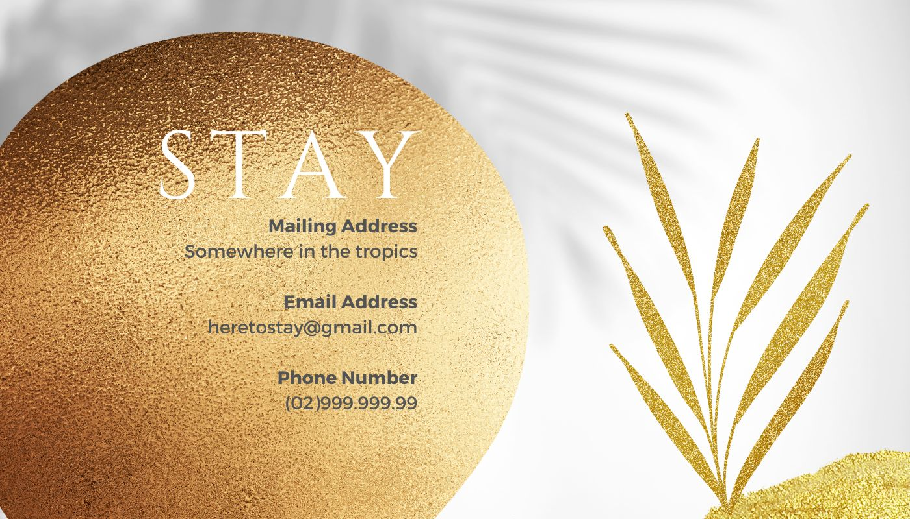

# Day 65 Hotel Website Design with Canva

## Overview

- Topics: Color Theory, Typography, User Interface (UI) Design, User Experience (UX) Design, Daily UI 

### The challenge

- Design a website on Canva

### Screenshots

### Links

- Solution URL: [Hotel Website Design with Canva](https://github.com/Mikerniker/100_Days_of_Python/tree/main/Day65)

### Built with

- Canva
